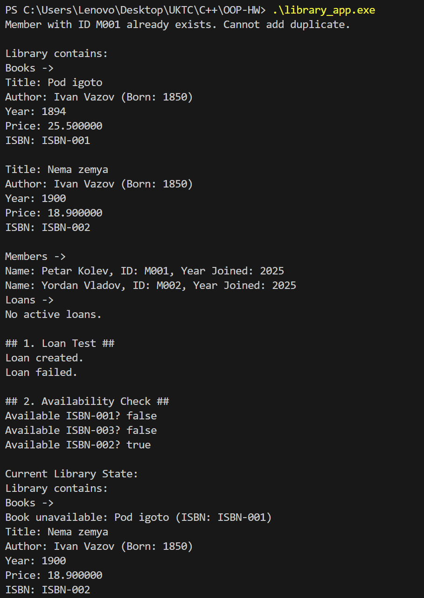

# OOP-HW

---

## Описание

Проектът **„Библиотечна Система“** представлява малка C++ система, която моделира основните операции на една библиотека: управление на книги, автори, членове и заеми.
Той демонстрира прилагането на основни обектно-ориентирани концепции в C++:

- конструктори и деструктори;
- капсулация и достъп чрез getters и setters;
- const-коректност и валидация на данни;
- статични членове и методи;
- добри ООП практики в реалистичен контекст.


## Компилация и Изпълнение

Отворете терминал в директорията (`OOP-HW/`) и изпълнете:

```bash
g++ -std=c++17 -Wall -Wextra -O2 -Iinclude main/Test.cpp src/*.cpp -o library_app
```
След това стартирайте програмата:

```bash
./library_app
```
## Структура на проекта

```text
OOP-HW/
├── include/ 
│ ├── Author.h
│ ├── Book.h
│ ├── Library.h
│ ├── Loan.h
│ └── Member.h
├── src/ 
│ ├── Author.cpp
│ ├── Book.cpp
│ ├── Library.cpp
│ ├── Loan.cpp
│ └── Member.cpp
├── main/ 
│ └── Test.cpp 
└── README.md 
```

## Примерен изход
```bash
Member with ID M001 already exists. Cannot add duplicate.

Library contains:
Books ->
Title: Pod igoto
Author: Ivan Vazov (Born: 1850)
Year: 1894
Price: 25.500000
ISBN: ISBN-001

Title: Nema zemya
Author: Ivan Vazov (Born: 1850)
Year: 1900
Price: 18.900000
ISBN: ISBN-002

Members ->
Name: Petar Kolev, ID: M001, Year Joined: 2025
Name: Yordan Vladov, ID: M002, Year Joined: 2025
Loans ->
No active loans.

## 1. Loan Test ##
Loan created.
Loan failed.

## 2. Availability Check ##
Available ISBN-001? false
Available ISBN-003? false
Available ISBN-002? true

Current Library State:
Library contains:
Books ->
Book unavailable: Pod igoto (ISBN: ISBN-001)
Title: Nema zemya
Author: Ivan Vazov (Born: 1850)
Year: 1900
Price: 18.900000
ISBN: ISBN-002

Members ->
Name: Petar Kolev, ID: M001, Year Joined: 2025
Name: Yordan Vladov, ID: M002, Year Joined: 2025
Loans ->
ISBN: ISBN-001
Member ID: M001
Start Date: 2025-12-03
Due Date: 2025-12-07
Returned: No


## 3. Return Book ##
Available ISBN-001? true

## 4. Find By Author ##
Found: Pod igoto
Found: Nema zemya

## 5. Books By Year (1900) ##
Found: Nema zemya

## 6. Final Library State ##
Library contains:
Books ->
Title: Pod igoto
Author: Ivan Vazov (Born: 1850)
Year: 1894
Price: 25.500000
ISBN: ISBN-001

Title: Nema zemya
Author: Ivan Vazov (Born: 1850)
Year: 1900
Price: 18.900000
ISBN: ISBN-002

Members ->
Name: Petar Kolev, ID: M001, Year Joined: 2025
Name: Yordan Vladov, ID: M002, Year Joined: 2025
Loans ->
ISBN: ISBN-001
Member ID: M001
Start Date: 2025-12-03
Due Date: 2025-12-07
Returned: Yes

```

##  Класове и Функционалност 

### Клас **`Author`** 
Представлява автор на книга с основни лични данни.

* **Член-данни (Private):**
    * `std::string name`
    * `int birthYear`
* **Конструктори:**
    * `Author()`
    * `Author(std::string authorName, int year)`
* **Методи (Public):**
    * `setBirthYear(int year)`: Задава година на раждане с **валидация** (трябва да е между 1850 и 2025 г.), използвайки `std::out_of_range`.
    * `to_string() const`: Връща форматиран низ с информация за автора.
    * **Getters:** `getName() const`, `getBirthYear() const`.

***

### Клас **`Book`** 
Представлява книга, като демонстрира **копираща и преместваща семантика** и **агрегира** обект `Author`.

* **Член-данни (Private):**
    * `std::string title`, `std::string isbn`
    * `Author author`
    * `int year`, `double price`
* **Статичен Член:**
    * `static int totalBooks`: **Брояч** на всички създадени обекти `Book`.
* **Специални Методи (Rule of Five):**
    * `Book(const Book&)`: **Копиращ конструктор**.
    * `Book(Book&&) noexcept`: **Преместващ конструктор** .
    * `operator=(const Book&)`: **Оператор за копиращо присвояване**.
    * `operator=(Book&&) noexcept`: **Оператор за преместващо присвояване**.
    * `~Book()`: **Деструктор**, който намалява `totalBooks`.
* **Методи (Public):**
    * `setPrice(double p)`: Задава цена с **валидация** (не може да бъде отрицателна), използвайки `std::invalid_argument`.
    * `setYear(int y)`: Задава година на издаване с **валидация** (1000-2025), използвайки `std::out_of_range`.
    * `static getTotalBooks()`: Връща общия брой създадени книги.
    * `to_string() const`: Връща форматиран низ с информация за книгата.
    * **Getters/Setters** за всички член-данни.

***

### Клас **`Member`** 
Представлява регистриран член на библиотеката с уникален идентификатор.

* **Член-данни (Private):**
    * `std::string name`, `std::string memberID`
    * `int yearJoined`
* **Конструктори:**
    * `Member()`
    * `Member(std::string name, std::string id, int year)`
* **Методи (Public):**
    * `setMemberID(const std::string& id)`: Задава ID с **валидация** (не може да е празен низ), използвайки `std::invalid_argument`.
    * `setYearJoined(int year)`: Задава година на присъединяване с **валидация** (1900-2025), използвайки `std::out_of_range`.
    * `to_string() const`: Връща форматиран низ с информация за члена.
    * **Getters:** `getName() const`, `getMemberID() const`, `getYearJoined() const`.

***

### Клас **`Loan`** 
Представлява запис за зает ресурс с информация за датите и статуса на връщане.

* **Член-данни (Private):**
    * `std::string isbn`, `std::string memberID`
    * `std::string startDate`, `std::string dueDate`
    * `bool returned`
* **Конструктори:**
    * `Loan()`
    * `Loan(...)`: Конструктор с **валидация** (dueDate не може да е преди startDate), използвайки `std::invalid_argument`.
* **Методи (Public):**
    * `markReturned(bool status)`: Променя статуса на заема.
    * `isOverdue(const std::string &currentDate) const`: Проверява дали заемът е просрочен спрямо текуща дата и не е върнат.
    * `to_string() const`: Връща форматиран низ с информация за заема.
    * **Getters:** `getIsbn() const`, `getMemberID() const`, `isReturned() const`, и т.н..

***

### Клас **`Library`** 
Управлява цялата библиотечна система, съхранявайки и обработвайки колекциите чрез **агрегация** (вектори).

* **Член-данни (Private):**
    * `std::vector<Book> books`
    * `std::vector<Member> members`
    * `std::vector<Loan> loans`
* **Методи за Управление (Public):**
    * `addBook(const Book &book)`: Добавя книга в наличност.
    * `addMember(const Member &member)`: Добавя член, като проверява за **дублиращи се ID-та** чрез `isMemberTaken`.
    * `loanBook(...)`: Създава нов заем, **само ако книгата е налична** (`isBookAvailable` е true).
    * `returnBook(...)`: Намира активния заем по ISBN и MemberID и променя статуса му на `returned = true`.
* **Методи за Търсене/Проверка:**
    * `isBookAvailable(const std::string &isbn) const`: Проверява дали книгата е в библиотеката (`hasBook`) и дали няма активен (невърнат) заем за нея.
    * `hasBook(const std::string &isbn) const`: Проверява дали книгата съществува в колекцията `books`.
    * `isMemberTaken(const std::string &memberID) const`: Проверява дали член с дадено ID вече съществува.
    * `findBooksByAuthor(...) const`: Връща вектор от книги от даден автор.
    * `getBooksByYear(...) const`: Връща вектор от книги, издадени през дадена година.
    * `to_string() const`: Връща пълно текстово представяне на състоянието на библиотеката (книги, членове, заеми).

## Част от екранна снимка



## Образователни цели

Проектът има за цел да демонстрира:

- разделение между интерфейс (.h) и имплементация (.cpp);
- използване на списъци за инициализация;
- валидация и обработка на изключения;
- работа със статични членове;
- прилагане на const-коректност.

## Автор

- Име: Петър Колев
- Номер: 22423
- Курс: Обектно-ориентирано програмиране (C++)
- Дата: 03.12.2025

